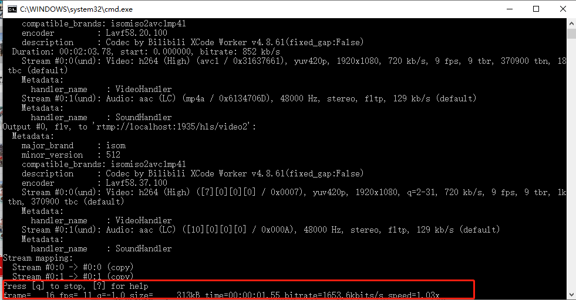

# nginx-live-serve-window-x64

nginx直播服务，支持hls和flv

### 运行 nginx

双击`nginx.exe`

### 关闭 nginx

双击`nginx-stop.bat`

### 推流

- 双击`push-video1.bat`，推`video1.mp4`
- 双击`push-video2.bat`，推`video2.mp4`

推流成功标志



### 推流地址

hls拉流地址

```
http://localhost:8090/hls/video1.m3u8
http://localhost:8090/hls/video2.m3u8
```

flv拉流地址
```
http://localhost:8090/flv?port=1935&app=hls&stream=video1
http://localhost:8090/flv?port=1935&app=hls&stream=video2
```

### 使用推流地址

参看这个项目的使用

https://github.com/nqdy666/videojs-live-demo

### 注意事项

- `nginx.exe`启动失败，注意排查是否80端口被占用
- `nginx.exe`切勿多次点击，会导致任务管理器出现多个nginx.exe
- `nginx-stop.bat`没有成功关闭nginx，可以查看任务管理器是否开启了多个nginx.exe，手动杀死进程。
